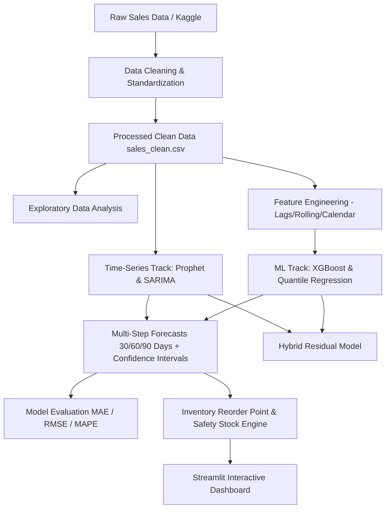

# RetailLens — System Architecture

## 1. System Overview

**RetailLens** is an end-to-end predictive time-series platform designed to forecast retail demand across 500 individual store-item time series (10 stores × 50 items) spanning 5 years of daily transactions (2013–2017). 

The platform powers inventory optimization, multi-horizon demand forecasting (30, 60, 90 days), uncertainty quantification (prediction intervals for safety stock), and low-stock alerting.

---

## 2. Module Boundaries & Data Contracts

### 2.1 Data Tier (`data/`, `src/clean_data.py`, `src/data_generator.py`)
- **Schema Contract**:
  - `date`: `YYYY-MM-DD` (ISO-8601 string or `pd.Timestamp`)
  - `store`: `int` (Store ID 1 to 10)
  - `item`: `int` (Item ID 1 to 50)
  - `sales`: `float` or `int` (Daily sales count $\ge 0$)
- **Data Partitions**:
  - `data/raw/`: Original downloaded CSVs (`train.csv`).
  - `data/processed/`: Cleansed, sorted, gap-free dataset (`sales_clean.csv`).
  - `data/processed/forecasts/`: Exported forecast outputs with lower/upper prediction intervals.

### 2.2 Time-Series Forecasting Tier (`src/models/`)
- **Prophet Engine (`prophet_model.py`)**:
  - Additive/Multiplicative seasonality decomposition.
  - Automatic weekly & yearly Fourier seasonality modeling.
  - Multi-step future horizon projections (30, 60, 90 days).
  - Continuous uncertainty intervals (`yhat_lower`, `yhat_upper`).
- **SARIMA Baseline (`sarima_model.py`)**:
  - Classical seasonal ARIMA baseline using `statsmodels.tsa.statespace.sarimax.SARIMAX`.
  - Benchmarks linear state-space performance against Prophet.
- **Hyperparameter Optimization (`hyperparameter_tuner.py`)**:
  - Rolling-origin cross validation with `prophet.diagnostics`.
  - Optuna / Grid search over changepoint flexibility, seasonality scale, and mode.
- **Evaluator (`evaluate_ts.py`)**:
  - Standardized metrics (MAE, RMSE, MAPE, sMAPE, Interval Coverage).
  - Out-of-sample holdout validation (e.g. final 90 days).

### 2.3 Consumption Tier
- **Outputs for XGBoost / Hybrid Modeling**:
  - Prophet trend + seasonality predictions serve as exogenous features or baseline for residual modeling ($y_{res} = y - \hat{y}_{prophet}$).
- **Outputs for Inventory / Dashboard**:
  - Forecast values $\hat{y}$ determine Expected Lead-Time Demand.
  - Interval spread ($\hat{y}_{upper} - \hat{y}_{lower}$) calibrates safety stock:
    $$SS = z \cdot \sigma_L \approx \frac{\hat{y}_{upper} - \hat{y}_{lower}}{2 \cdot 1.96} \cdot \sqrt{L}$$
  - Dynamic Reorder Point: $ROP = \text{Lead Time Demand} + SS$.

---

## 3. Technology Stack & Dependencies

| Layer | Technologies |
|---|---|
| Core Language | Python 3.10+ |
| Data Processing | `pandas`, `numpy` |
| Time-Series Modeling | `prophet`, `statsmodels` |
| Machine Learning | `scikit-learn`, `xgboost`, `optuna` |
| Explainability & Analysis | `shap`, `matplotlib`, `plotly` |
| Web Application | `streamlit` |
| Testing | `unittest`, `pytest` |
