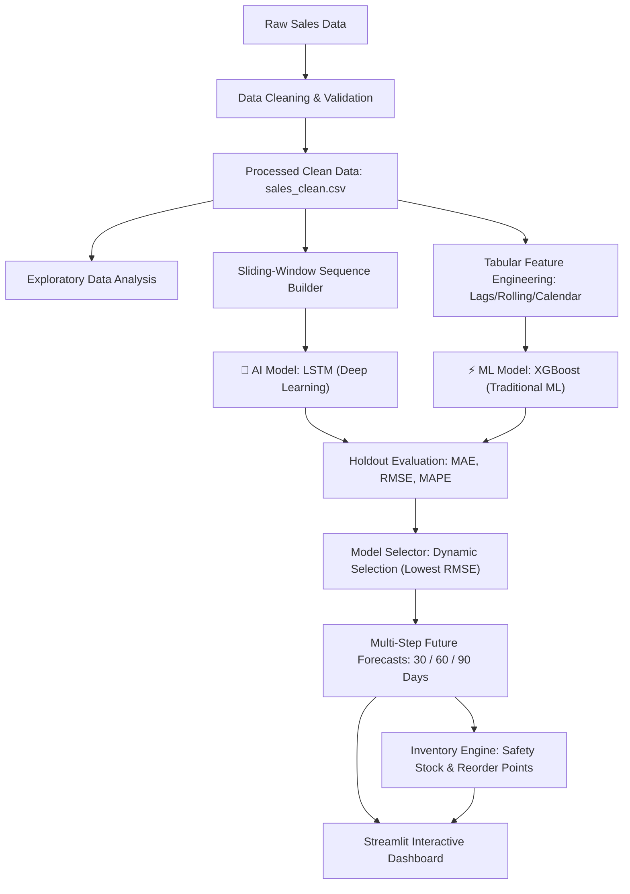

# RetailLens — System Architecture

## 1. System Overview

**RetailLens** is an end-to-end predictive retail analytics and inventory recommendation platform designed to forecast store-item demand across 500 individual time series (10 stores × 50 items) spanning 5 years of daily transactions (2013–2017).

The system operates on a dual-model architecture:
1. **AI Model (Deep Learning)**: Long Short-Term Memory (**LSTM**) neural network capturing complex temporal dependencies, sequential context, and long-range non-linear trends.
2. **ML Model (Machine Learning)**: Extreme Gradient Boosting (**XGBoost**) utilizing tabular feature engineering (calendar signals, multi-horizon lags, rolling statistics).

Both models compete on a strict chronological holdout test period. A data-driven `ModelSelector` dynamically identifies the superior model per series based on holdout RMSE/MAE (with no hard-coded winner), passing the optimal forecast to the inventory optimization engine and Streamlit dashboard.

```mermaid
graph TD
    A[Raw Sales Data] --> B[Data Cleaning & Validation]
    B --> C[Processed Clean Data: sales_clean.csv]
    
    C --> D[Exploratory Data Analysis]
    C --> E[Sliding-Window Sequence Builder]
    C --> F[Tabular Feature Engineering: Lags/Rolling/Calendar]
    
    E --> G["🧠 AI Model: LSTM (Deep Learning)"]
    F --> H["⚡ ML Model: XGBoost (Traditional ML)"]
    
    G --> I[Holdout Evaluation: MAE, RMSE, MAPE]
    H --> I
    
    I --> J["Model Selector: Dynamic Selection (Lowest RMSE)"]
    J --> K[Multi-Step Future Forecasts: 30 / 60 / 90 Days]
    
    K --> L[Inventory Engine: Safety Stock & Reorder Points]
    K --> M[Streamlit Interactive Dashboard]
    L --> M
```

---

## 2. Dual-Model Architecture & Data Flow

### 2.1 Data Tier (`data/`, `src/clean_data.py`, `src/data_generator.py`)
- **Schema Contract**:
  - `date`: `YYYY-MM-DD` (ISO-8601 string or `pd.Timestamp`)
  - `store`: `int` (Store ID 1 to 10)
  - `item`: `int` (Item ID 1 to 50)
  - `sales`: `float` or `int` (Daily sales count $\ge 0$)
- **Data Partitions**:
  - `data/raw/`: Original transactional dataset (`train.csv`).
  - `data/processed/`: Cleansed, chronological, gap-free series (`sales_clean.csv`).
  - `data/processed/forecasts/`: Exported forecast outputs (`lstm_s{store}_i{item}.csv`, `xgboost_s{store}_i{item}.csv`).
  - `data/processed/models/`: Saved model artifacts (`.keras` weights, `.joblib` estimators, scalers).

### 2.2 AI Model Tier: LSTM Deep Learning (`src/models/lstm_model.py`, `src/features/lstm_features.py`)
- **Architecture**:
  - 2-layer stacked LSTM network built with TensorFlow/Keras.
  - Dropout regularization (0.2) to prevent overfitting on seasonal noise.
  - Dense prediction head for multi-step autoregressive forecasting.
- **Feature Pipeline**:
  - MinMax normalization fitted strictly on training partition (preventing data leakage).
  - Sliding-window sequences of lookback $W$ (default: 30 days) mapped to target $y_{t+1}$.
  - Uncertainty quantification derived from rolling residual standard deviation.

### 2.3 ML Model Tier: XGBoost (`src/models/xgboost_model.py`, `src/features/feature_engineering.py`)
- **Feature Matrix**:
  - **Calendar**: Day of week, day of month, month, year, weekend indicator, day of year.
  - **Lags**: 7, 14, 21, 28, 30, 60, 90, 365 days.
  - **Rolling Aggregations**: 7, 14, 30, 90-day rolling means and standard deviations (strictly lagged to prevent lookahead leakage).
- **Model**:
  - Gradient boosted trees optimized with early stopping on validation split.
  - Recursive multi-step projection for 30, 60, and 90-day future horizons.

### 2.4 Model Selection & Training Pipeline (`src/models/model_selector.py`, `src/train.py`)
- **Holdout Evaluation**:
  - Chronological holdout window (default: last 90 days) ensuring zero lookahead bias.
  - Metrics computed: MAE, RMSE, MAPE.
- **Dynamic Selection (`ModelSelector`)**:
  - Compares holdout RMSE as primary metric, with MAE as tie-breaker.
  - Selection is completely data-driven — no predetermined winner.
  - Outputs comprehensive comparison summary to `reports/model_comparison_s{store}_i{item}.json`.

### 2.5 Inventory Recommendation Tier (`src/inventory.py`)
- Computes inventory parameters using the winning model's forecast:
  - **Lead-Time Demand**: $\hat{D}_L = \sum_{t=1}^{L} \hat{y}_t$
  - **Safety Stock**: $SS = Z_{\alpha} \times \sigma_d \times \sqrt{L}$ (calibrated for 95% service level)
  - **Reorder Point (ROP)**: $ROP = \hat{D}_L + SS$
  - **Alerting**: Low-stock trigger when Current Inventory $\le ROP$.

### 2.6 Dashboard Tier (`app/streamlit_app.py`)
- Interactive multi-tab web application:
  - **Overview**: High-level sales metrics, KPI summary.
  - **Historical Analysis**: Time-series exploration, seasonality patterns.
  - **Forecast**: Interactive Plotly projections with confidence bands for 30/60/90 days.
  - **Model Comparison**: Side-by-side metric tables (AI LSTM vs ML XGBoost).
  - **ML Evaluation**: Architectural breakdown, feature importances, holdout comparisons.
  - **Stock Alerts**: Automated inventory health recommendations, reorder warnings.
  - **Data Explorer**: Raw data filtering and CSV exports.

---

## 3. Technology Stack & Dependencies

| Layer | Technologies |
|---|---|
| Core Language | Python 3.10+ |
| Data Processing | `pandas`, `numpy` |
| AI / Deep Learning | `tensorflow`, `keras` |
| Machine Learning | `xgboost`, `scikit-learn`, `joblib` |
| Visualization & Metrics | `plotly`, `matplotlib`, `scipy` |
| Web Application | `streamlit` |
| Testing | `pytest`, `unittest` |
